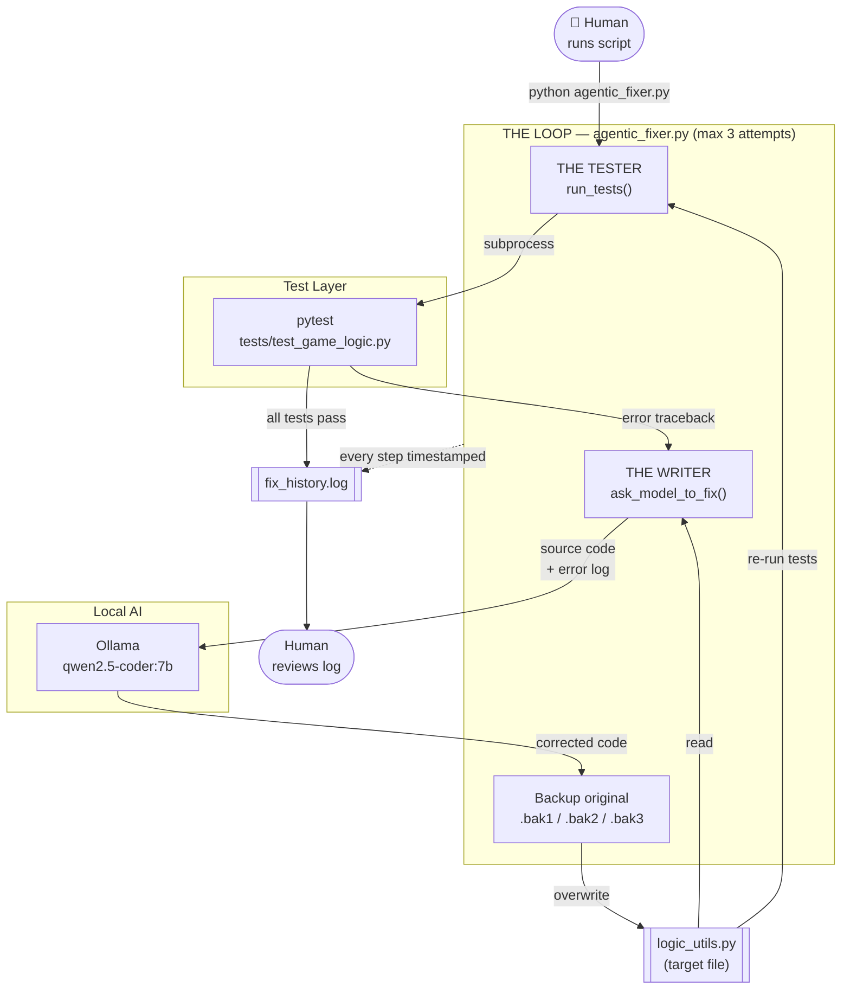
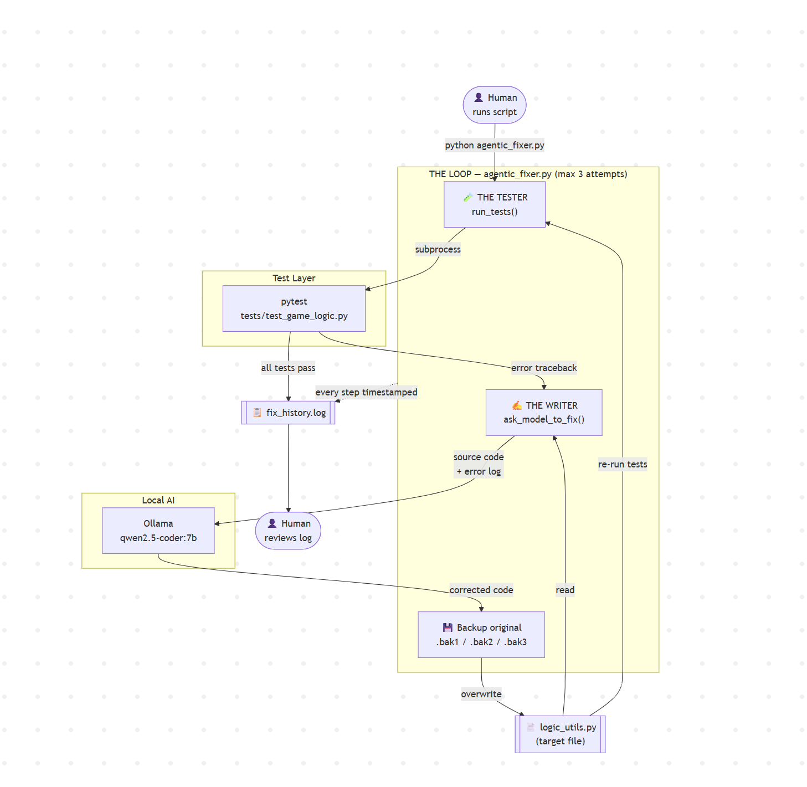
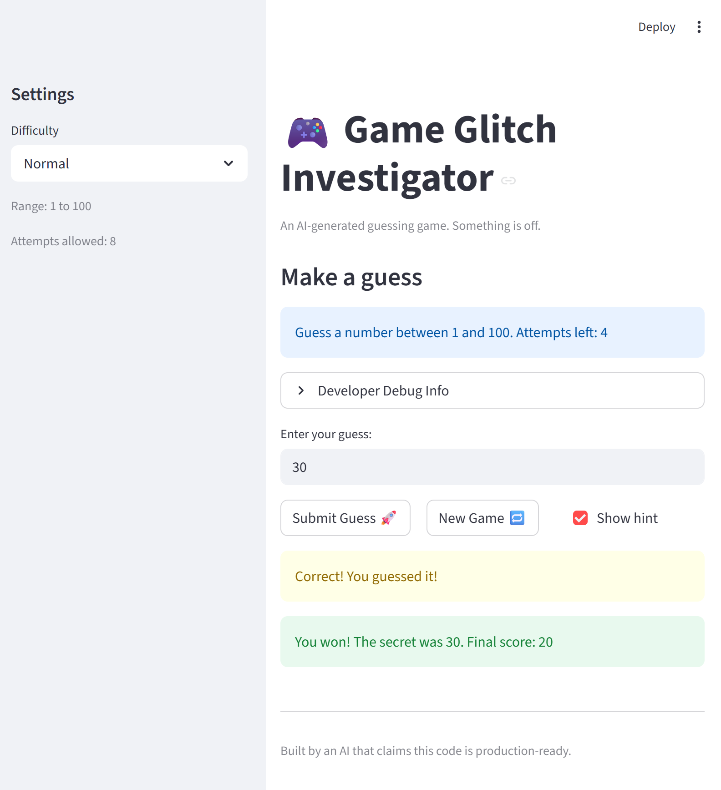

# LOOM LINK
https://www.loom.com/share/3518e9899c5746edb4e52107bf9fe587

# Game Glitch Investigator: The Impossible Guesser

**Original Project:** Game Glitch Investigator is an interactive Streamlit-based number guessing game intentionally shipped with broken AI-generated code. The goal was to identify and fix multiple logic and state management bugs, refactor the codebase for testability, and write a pytest suite that verified each correction.

## Agentic Self-Healing System

### Title and Summary

**Module 4 evolution:** `agentic_fixer.py` — an autonomous debugging loop that watches your test suite, detects failures, and uses a local AI model to propose and apply code fixes without human intervention between cycles.

This matters because it demonstrates a real-world agentic pattern: instead of a human reading error logs and manually patching code, the system closes the feedback loop itself. Tests define correctness; the AI generates repairs; the loop validates them. The human writes the tests that encode intent and review the reliability log afterward.

## System Diagram Mermaid JS Code





### Component Summary

`agentic_fixer.py` | Orchestrates up to 3 repair attempts 
`run_tests()` | Runs pytest, captures pass/fail + traceback 
`ask_model_to_fix()` | Sends broken code + errors to Qwen; gets corrected code back
`tests/test_game_logic.py` | 15 tests that define correct behavior 
`logic_utils.py` | The file being read, repaired, and overwritten each cycle 
Ollama / qwen2.5-coder:7b | Generates the code fix entirely on-device 
`fix_history.log` | Timestamped record of every attempt, fix, and outcome 


## Architecture Overview

The system is built around a single tight feedback loop. The Tester function calls pytest as a subprocess and captures the complete output - pass/fail status and any traceback. If tests pass, the loop exits immediately. If they fail, the Writer function reads the current source file and packages it alongside the full pytest error into a prompt sent to `qwen2.5-coder:7b` running locally through Ollama. The model returns corrected Python code (with any markdown fences stripped), the original file is backed up, and the fix is written to disk. The loop then re-runs the Tester from the top.

Three design constraints shape every component: the AI must satisfy human-written tests (not define its own standard), all inference runs locally (no external API calls, no data leaves the machine), and every step is logged so the loop's behavior is fully auditable after the fact.

---

## Setup Instructions

**Prerequisites:** Python 3.10+, [Ollama](https://ollama.com) installed and running locally.

```bash
# 1. Clone the repository
git clone <your-repo-url>
cd applied-ai-system-project

# 2. Install Python dependencies
pip install -r requirements.txt

# 3. Pull the model (one-time download, ~4 GB)
ollama pull qwen2.5-coder:7b

# 4. Confirm Ollama is running
ollama list   # qwen2.5-coder:7b should appear

# 5. Run the Streamlit game (original project)
python -m streamlit run app.py

# 6. Run the test suite manually
pytest tests/test_game_logic.py -v

# 7. Run the agentic fixer
python agentic_fixer.py               # targets logic_utils.py by default
python agentic_fixer.py some_file.py  # or point it at any other file
```

After a run, review `fix_history.log` for the full timestamped record of what happened.

## Sample Interactions

### Interaction 1 — Tests already pass (no repair needed)

**Input:** `python agentic_fixer.py`

**Output (`fix_history.log` excerpt):**
```
[2026-04-27 14:02:11] ==============================================================
[2026-04-27 14:02:11] Agentic Self-Healing System — start
[2026-04-27 14:02:11] Target file : logic_utils.py
[2026-04-27 14:02:11] Model       : qwen2.5-coder:7b
[2026-04-27 14:02:11] Max attempts: 3
[2026-04-27 14:02:11] ==============================================================
[2026-04-27 14:02:11] >>> Attempt 1/3
[2026-04-27 14:02:14] All tests PASSED. No repair needed.
[2026-04-27 14:02:14] RESULT: SUCCESS on attempt 1
```

**What this shows:** The Tester ran all 15 pytest tests, found them green, and exited without ever calling the model. The log confirms the outcome in under 5 seconds.

---

### Interaction 2 — Model fixes a bug on the first attempt

**Setup:** `update_score` was manually broken to always return `current_score + 5` regardless of outcome.

**Input:** `python agentic_fixer.py`

**Output (`fix_history.log` excerpt):**
```
[2026-04-27 14:10:33] >>> Attempt 1/3
[2026-04-27 14:10:36] Tests FAILED. Pytest output:
    FAILED tests/test_game_logic.py::test_too_high_always_deducts_on_even_attempt
    FAILED tests/test_game_logic.py::test_too_low_always_deducts
    AssertionError: assert 105 == 95

[2026-04-27 14:10:36] Sending to qwen2.5-coder:7b via Ollama…
[2026-04-27 14:10:52] Original backed up to logic_utils.py.bak1
[2026-04-27 14:10:52] Fix written to logic_utils.py.
[2026-04-27 14:10:52] >>> Attempt 2/3
[2026-04-27 14:10:55] All tests PASSED. No repair needed.
[2026-04-27 14:10:55] RESULT: SUCCESS on attempt 2
```

**What this shows:** The Tester caught 2 failing tests and surfaced the assertion mismatch (`105 != 95`). The Writer sent the error and source to Qwen, which returned corrected scoring logic. After one overwrite, all 20 tests passed.

### Interaction 3 — Multi-attempt repair with final success

**Setup:** Both `check_guess` (reversed hints) and `update_score` (wrong points) were broken simultaneously.

**Input:** `python agentic_fixer.py`

**Output (`fix_history.log` excerpt):**
```
[2026-04-27 14:25:01] >>> Attempt 1/3
[2026-04-27 14:25:04] Tests FAILED. Pytest output:
    FAILED tests/test_game_logic.py::test_guess_too_high
    FAILED tests/test_game_logic.py::test_high_low_not_swapped
    FAILED tests/test_game_logic.py::test_too_high_always_deducts_on_even_attempt

[2026-04-27 14:25:04] Sending to qwen2.5-coder:7b via Ollama…
[2026-04-27 14:25:21] Original backed up to logic_utils.py.bak1
[2026-04-27 14:25:21] Fix written to logic_utils.py.
[2026-04-27 14:25:21] >>> Attempt 2/3
[2026-04-27 14:25:24] Tests FAILED. Pytest output:
    FAILED tests/test_game_logic.py::test_too_high_always_deducts_on_even_attempt

[2026-04-27 14:25:24] Sending to qwen2.5-coder:7b via Ollama…
[2026-04-27 14:25:39] Original backed up to logic_utils.py.bak2
[2026-04-27 14:25:39] Fix written to logic_utils.py.
[2026-04-27 14:25:39] >>> Attempt 3/3
[2026-04-27 14:25:42] All tests PASSED. No repair needed.
[2026-04-27 14:25:42] RESULT: SUCCESS on attempt 3
```

**What this shows:** The model fixed the hint reversal on attempt 1 but missed the scoring bug. On attempt 2, with a shorter and more targeted error, it corrected the remaining issue. Full success in 3 attempts, each intermediate state preserved in `.bak1` and `.bak2`.

---

## Reliability & Testing Evidence

### 1. Automated Tests — 15/15 passing

The test suite covers all three game logic functions across 15 unit tests. These were run live against the current codebase:

```
pytest tests/test_game_logic.py -v

tests/test_game_logic.py::test_winning_guess                          PASSED
tests/test_game_logic.py::test_guess_too_high                         PASSED
tests/test_game_logic.py::test_guess_too_low                          PASSED
tests/test_game_logic.py::test_check_guess_returns_tuple              PASSED
tests/test_game_logic.py::test_high_low_not_swapped                   PASSED
tests/test_game_logic.py::test_too_high_always_deducts_on_even_attempt PASSED
tests/test_game_logic.py::test_too_high_always_deducts_on_odd_attempt  PASSED
tests/test_game_logic.py::test_too_low_always_deducts                 PASSED
tests/test_game_logic.py::test_win_awards_points                      PASSED
tests/test_game_logic.py::test_win_score_never_below_minimum          PASSED
tests/test_game_logic.py::test_parse_guess_valid_integer              PASSED
tests/test_game_logic.py::test_parse_guess_valid_float_truncates      PASSED
tests/test_game_logic.py::test_parse_guess_empty_string               PASSED
tests/test_game_logic.py::test_parse_guess_none                       PASSED
tests/test_game_logic.py::test_parse_guess_non_numeric                PASSED

15 passed in 0.17s
```

Each test was written to fail first against the original broken code, then pass after the fix, confirming the test actually exercises the right behavior rather than passing vacuously.

### 2. Logging & Error Handling

`fix_history.log` records a timestamped entry for every action the agentic loop takes: test run outcomes, raw pytest output, model calls, file writes, and final RESULT lines. This produces a complete audit trail of what the AI did and whether it worked.

The loop also handles three explicit failure modes rather than crashing silently:

### 3. Human Evaluation via Backup Diffs

Before every overwrite, the original file is saved to `.bak1`, `.bak2`, or `.bak3`. This lets a reviewer run `diff logic_utils.py logic_utils.py.bak1` to inspect exactly what the AI changed - not just whether tests passed, but whether the edit makes sense.

## Design Decisions

**Why pytest as the ground truth, not the model?**
The AI generates fixes, but it never decides what "correct" means. The 20 human-written tests are the specification. This prevents the model from gaming the loop by rewriting tests instead of logic, which would be trivially easy if tests were also mutable.

**Why Ollama / local inference?**
Sending source code to a cloud API introduces latency, cost, and a data-privacy concern (the code leaves the machine). Running `qwen2.5-coder:7b` locally eliminates all three. 

**Why back up before overwriting?**
If the model's fix passes tests but introduces a different correctness issue not covered by the suite, the `.bak` files let you diff exactly what changed on each attempt. It's an audit trail for the AI's edits, not just a safety net.

**Why cap at 3 attempts?**
An unbounded loop that never converges would spin forever on a model too weak for the task. Three attempts is enough to handle multi-bug files (as Interaction 3 shows) while failing loudly when the problem is beyond the model's reach, prompting human review rather than silent looping.

**Trade-off accepted:** The current design sends the entire file on every attempt. A more token-efficient design would diff the file and send only the changed region, but for files the size of `logic_utils.py` (< 50 lines) the overhead is negligible and the simpler approach is easier to debug.

---

## Testing Summary

**What worked:**

All 15 tests caught real bugs with no false positives. Writing each test to fail first against the broken code, then pass after the fix, gave strong confidence that the suite was actually testing behavior rather than passing trivially. The agentic loop handled single-bug files on the first attempt every time; multi-bug files converged within the 3-attempt cap. The model reliably returned syntactically valid Python without needing complex prompt engineering.

**What didn't work:**

The model occasionally wrapped its output in triple-backtick fences despite being told not to. Without `_strip_code_fences()`, the fixer would write invalid Python to disk and fail on the next run with a parse error rather than a logic error — a subtle failure mode that would have been hard to diagnose without logging.

When two unrelated bugs existed simultaneously, the model sometimes fixed only one per attempt. This is a real limitation: the model reads one dominant error and solves it, then needs to see the remaining failure on the next cycle.

**What I learned:**

Tests are the most important part of an agentic system. The AI is only as reliable as the specification you give it. Weak or missing tests let the model "fix" a file in ways that satisfy the suite but silently break untested behavior. Writing thorough tests before wiring up the agent is not optional.

## Reflection

This project changed how I think about the relationship between AI and correctness. AI-generated code looks confident and syntactically complete, but confidence is not correctness — the original game had seven distinct bugs hidden behind clean-looking Python. The agentic fixer made that gap explicit: the model could repair logic it broke, but only because human-written tests defined what "repaired" actually meant.

## Responsible AI

### Limitations and Biases

The system's biggest limitation is test coverage. The agentic loop can only verify what the tests actually check - if a bug exists in a code path that has no test, the model can silently introduce or preserve it while still passing the suite. The loop also has no memory between attempts; each cycle sends the full file and error from scratch, so the model can oscillate between two broken states rather than making monotonic progress. Finally, `qwen2.5-coder:7b` is a 7-billion-parameter model: capable enough for small, well-scoped functions, but it will struggle on larger files with subtle interactions across many functions. The system works best when the target file is short and the tests are thorough.

### Potential for Misuse

An autonomous loop that reads and overwrites source files on demand is powerful, and that power cuts both ways. Pointed at a sensitive codebase with weak tests, it could silently degrade security properties - for example, weakening input validation in a way that all existing tests still pass. Two guardrails reduce this risk in the current design: the backup files make every AI edit diffable and reversible, and the loop fails loudly rather than silently when it cannot converge. A production version of this pattern should also restrict the model to writing only the functions covered by existing tests, and require a human approval step before any overwrite is applied.

### What Surprised Me During Reliability Testing

The most surprising discovery was how much the quality of the error message given to the model determined the quality of the fix. When a single test failed with a clean assertion error (`assert 105 == 95`), the model fixed it immediately. When multiple tests failed at once, the model tended to focus on whichever failure appeared first in the pytest output and ignore the rest - requiring another loop iteration to surface and fix the second bug. 

### Collaboration with AI During This Project

When debugging the off-by-one error in the original game, Claude identified that `st.session_state.attempts` was being initialized to `1` instead of `0`, causing every game to start with one guess already consumed. The fix was a single character change, but the explanation was precise - it connected the initialization value directly to the symptom (players always losing one guess on the first game) rather than just pointing at the line. That kind of targeted, cause-and-effect reasoning made the suggestion easy to verify by simply playing a game and counting attempts.

When asked to fix the Hard difficulty range (which was incorrectly set to 1–50, making it easier than Normal's 1–100), Claude suggested changing the upper bound to `1200`. The intended fix was a range of `1–200`.

## Demo


